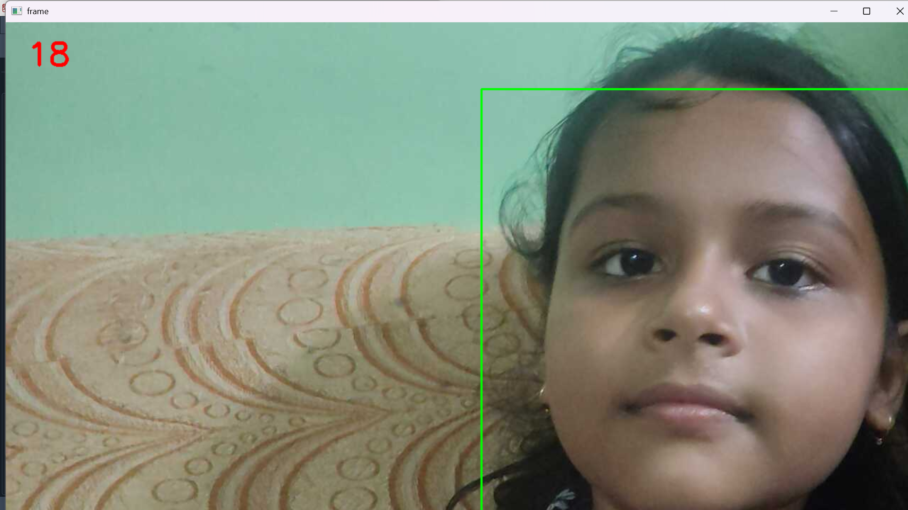
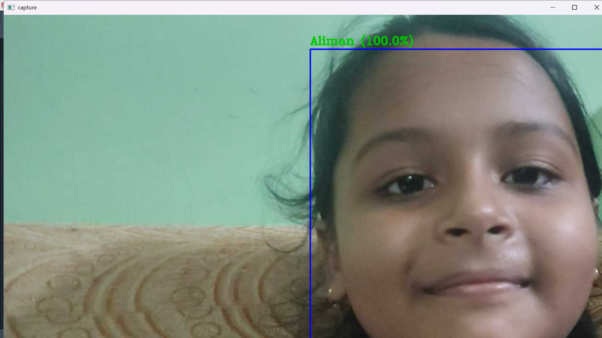
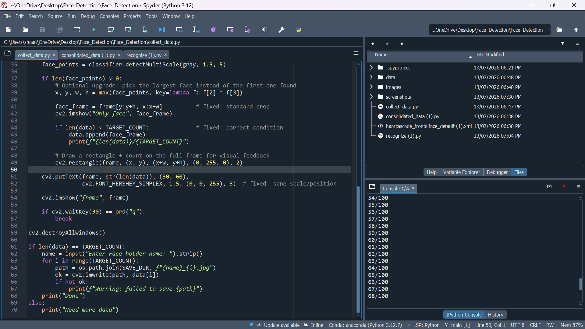

# Face Detection and Recognition using Deep Learning

A real-time Face Detection and Face Recognition system built using **Python**, **OpenCV**, **TensorFlow/Keras**, and an **Android IP Webcam**. The project captures face images, prepares a dataset, trains a deep learning model, and recognizes faces in real time.

---

## Features

- Real-time face detection using Haar Cascade Classifier
- Face image collection using Android IP Webcam
- Automatic dataset creation
- Face preprocessing and training data generation
- Deep learning based face recognition using TensorFlow/Keras
- Real-time prediction with confidence score
- Easy to customize for multiple users

---

## Project Structure

```
Face_Detection/
│
├── collect_data.py                # Collect face images
├── consolidated_data.py           # Prepare dataset
├── recognize.py                   # Real-time face recognition
├── final_model.h5                 # Trained model
├── haarcascade_frontalface_default.xml
├── images/                        # Captured face images
├── data/                          # Processed dataset
└── README.md
```

---

## Technologies Used

- Python 3.12
- OpenCV
- NumPy
- TensorFlow / Keras
- Android IP Webcam
- Haar Cascade Classifier

---

## Installation

### Clone the repository

```bash
git clone https://github.com/yourusername/Face_Detection.git
cd Face_Detection
```

### Create a virtual environment (Optional)

```bash
python -m venv venv
```

Activate it

Windows

```bash
venv\Scripts\activate
```

Linux / macOS

```bash
source venv/bin/activate
```

### Install dependencies

```bash
pip install opencv-python
pip install numpy
pip install tensorflow
pip install keras
```

or

```bash
pip install -r requirements.txt
```

---

## How to Use

### Step 1: Start IP Webcam

1. Install **IP Webcam** on your Android device.
2. Connect your phone and computer to the same Wi-Fi network.
3. Start the server in the app.
4. Copy the IP address shown in the app.

Example:

```
http://192.168.1.5:8080/shot.jpg
```

Update the URL variable in the Python files.

---

### Step 2: Collect Images

Run

```bash
python collect_data.py
```

This captures face images and stores them in the `images` folder.

---

### Step 3: Prepare Dataset

Run

```bash
python consolidated_data.py
```

This processes the collected images and prepares the dataset.

---

### Step 4: Train the Model

Train your TensorFlow/Keras model and save it as

```
final_model.h5
```

---

### Step 5: Run Face Recognition

```bash
python recognize.py
```

The application will:

- Detect faces
- Predict the person
- Display confidence score
- Show recognition results in real time

---
## Screenshots

### Face Detection



### Face Recognition



### Dataset Collection


## Requirements

- Python 3.12
- OpenCV
- NumPy
- TensorFlow
- Keras
- Android IP Webcam

---

## Future Improvements

- Multiple face recognition
- Face mask detection
- Face attendance system
- Database integration
- Anti-spoofing detection
- GPU acceleration
- Better CNN architecture

---

## Troubleshooting

### TensorFlow Import Error

Install a TensorFlow version compatible with your Python version.

### OpenCV Camera Error

- Ensure the IP Webcam server is running.
- Verify the IP address is correct.
- Make sure both devices are connected to the same network.

### Model Not Found

Ensure the trained model exists as

```
final_model.h5
```

---

## License

This project is intended for educational and learning purposes.

---

## Author

**Sk Aminul Irfan**

GitHub: https://github.com/shaan150406-svg

---

⭐ If you found this project useful, consider giving the repository a star!
