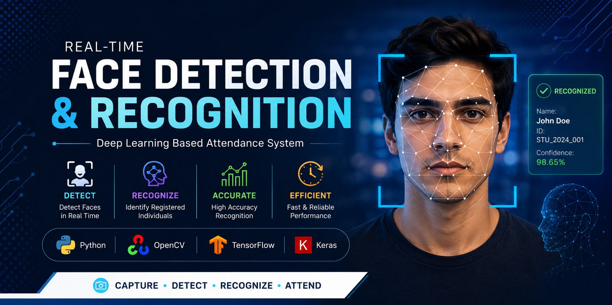
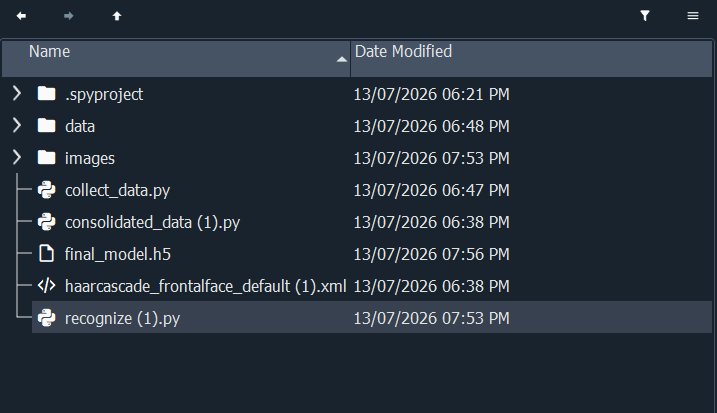

# 🎭 Face Detection & Recognition using Deep Learning

<p align="center">
  
</p>

<p align="center">


</p>

A real-time Face Detection and Face Recognition system built using **Python**, **OpenCV**, and **TensorFlow/Keras**. The application detects faces from a live camera feed, recognizes registered users, and displays predictions in real time.

---

## 📌 Features

- 🎥 Real-time face detection
- 🧠 Deep learning based face recognition
- 📷 Dataset collection using IP Webcam
- 📂 Automatic dataset preparation
- ⚡ Fast prediction with confidence score
- 👨‍💻 Easy to extend for multiple users

---

# 📸 Screenshots

## Dataset Collection


---

## Face Detection


## Face Recognition


---

## Project Structure



---

## ⚙️ Technologies Used

- Python
- OpenCV
- TensorFlow
- Keras
- NumPy
- Android IP Webcam

---

## 📂 Project Structure

```text
Face_Detection/
│
├── data/
├── images/
├── screenshots/
├── collect_data.py
├── consolidated_data.py
├── recognize.py
├── final_model.h5
├── haarcascade_frontalface_default.xml
├── requirements.txt
├── README.md
└── .gitignore
```

---

## 🚀 Installation

```bash
git clone https://github.com/shaan150406-svg/Face-Detection-Attendance-System.git

cd Face-Detection-Attendance-System

pip install -r requirements.txt
```

---

## ▶️ Run

Collect Dataset

```bash
python collect_data.py
```

Prepare Dataset

```bash
python consolidated_data.py
```

Recognize Faces

```bash
python recognize.py
```

---

## 📈 Future Improvements

- Multiple face recognition
- Face attendance logging
- Database integration
- Anti-spoofing
- GUI dashboard
- Cloud deployment

---

## 👨‍💻 Author

**Sk Aminul Irfan**

GitHub: https://github.com/shaan150406-svg

⭐ Star this repository if you found it useful!
